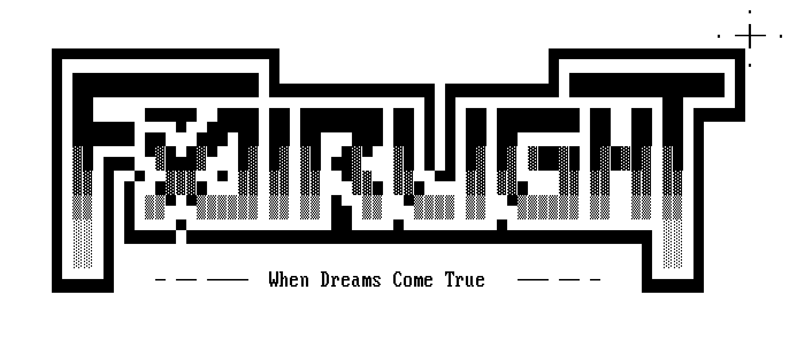

# nfo2png
*Greg Kennedy, 2021*

Render ASCII text files to PNG images.

## Usage

    cat input.txt | ./nfo2png.pl > output.png

## About
This is a tool to render an ASCII text file to a .png output.  There is only one code page supported, [CP437](https://en.wikipedia.org/wiki/Code_page_437), and only one choice of font: the [VGA BIOS 9x16 font](https://int10h.org/oldschool-pc-fonts/fontlist/font?ibm_vga_9x16) from the IBM PS/2.

The restrictive set of output formats is deliberate.  This script is part of a larger project and is used to render .nfo files, commonly distributed by warez groups along with their releases.  NFO files were usually intended for viewing on ANSI-compatible systems, especially MS-DOS, and often featured elaborate ASCII art or logos built from the standard CP437 character set.  These systems are rare today: for example, Windows 95 would instead use [Windows-1252](https://en.wikipedia.org/wiki/Windows-1252) by default, replacing many of the box-drawing characters with international characters (accented vowels, etc) instead.

The IBM PS/2, in VGA Text mode, could display 80x25 characters on screen pulled from a 9x16 font.  This makes effectively a 720x400 pixel "virtual" screen.  However, CRT monitors at the time were exclusively 4:3 which caused the mode to use non-square pixels.  In other words, the font at 1:1 appears too wide.  The image should be scaled vertically by 1.35x to make a "correct" image.  This tool supports integer scaling of the output: with `SCALE_W` of 3, and `SCALE_H` of 4, we achieve a 1.33x vertical increase - quite close to the intended value.

## Config
A few settings are available by editing these constants at the top of the script:

    use constant {
      MARGIN_W => 0,
      MARGIN_H => 0,
      SCALE_W => 3,
      SCALE_H => 4,
      INVERT => 0
    };

`MARGIN_W` and `MARGIN_H` add extra padding to the sides and top/bottom of the output.  The values are in whole-character units, so `MARGIN_W => 1` creates an 82-column-wide output image, where the left- and right-most columns are always empty.  Similarly, `MARGIN_H => 1` effectively adds a blank line to the top and bottom of the output.

`SCALE_W` and `SCALE_H` repeat columns or rows in the output image to perform nearest-neighbor upscaling.  The minimum values are 1 for each, and must be whole integer values.  As stated earlier, `SCALE_W => 3` and `SCALE_H => 4` achieves a nearly 4:3 aspect ratio as it would appear on legacy hardware.

`INVERT` can be 0 or 1.  When set to 1 it swaps the black and white pixels - in other words, the image will become black text on a white background.

## Hacking
The IBM BIOS font is stored as a 16-element list constant, containing long strings of hex characters.  Characters are 9 bits wide, which makes editing complicated.  These values were obtained by taking a 256x1 image of the IBM character set, converting to .pbm format, and extracting the image data.  Perl's `vec()` function works only in little-endian mode, so it was necessary to reverse the bit positions of each byte when creating the font constant.

[Devel::NYTProf](https://metacpan.org/pod/Devel::NYTProf) was helpful in identifying hot areas of the code to improve, allowing me to drastically cut the runtime.
